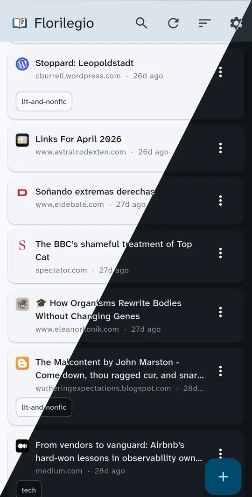

# Florilegio

A personal read-it-later app. Much like Pocket (RIP) or Raindrop.io, but you run it yourself on Cloudflare's free tier.

<p align="center">
  
</p>

## Features

- **Flutter client** for Android and the web — one codebase, both platforms.
- **Firefox extension** to save the current tab with one click.
- **Hono backend** on Cloudflare Workers with SQLite (D1) for storage.
- **Raindrop.io importer** to bring your existing bookmarks across.
- **Single static token** for auth — no accounts, no OAuth.
- Designed to fit comfortably inside Cloudflare's free tier.

## Deploy your own

You'll end up with the worker deployed to Cloudflare and the web client running at a Cloudflare Pages URL.

### Prerequisites

- A free [Cloudflare account](https://dash.cloudflare.com/sign-up).
- [`mise`](https://mise.jdx.dev/) to manage tool versions and run the tasks.

### 1. Clone and install tools

```sh
git clone https://github.com/guille/florilegio.git
cd florilegio
mise install
```

This installs all the needed development tools and runs first-time setup tasks.

### 2. Create your D1 database

```sh
cd worker
wrangler d1 create bookmarks
```

Copy the printed `database_id` into `worker/wrangler.jsonc`, replacing the existing one.

### 3. Generate and set your API token

```sh
TOKEN=$(openssl rand -base64 32)
echo "$TOKEN"   # save this — you'll need it for the client
wrangler secret put API_TOKEN
# paste the same token when prompted
```

The token must match [RFC 6750](https://www.rfc-editor.org/rfc/rfc6750)'s `Bearer` token grammar. `openssl rand -base64 32` produces one that does.

### 4. Apply schema and deploy the worker

```sh
mise run apply-schema:remote
mise run deploy
```

Note the worker URL (e.g. `https://florilegio.<your-subdomain>.workers.dev`).

### 5. Build and deploy the web client

```sh
cd ../client
mise run deploy:web
```

The first run will prompt you to create a Cloudflare Pages project. Pick a name and accept the defaults. After deploy, note the Pages URL (e.g. `https://florilegio-xyz.pages.dev`).

### 6. Configure the client

Open your Pages URL. The app boots into the settings screen until you provide:
- **Endpoint URL**: your worker URL from step 4.
- **Token**: the API token from step 3.

Save. You should now be looking at your (empty) reading list.

### 7. (Optional) Install the Firefox extension

Download the signed XPI from [the latest release](https://github.com/guille/florilegio/releases/latest) and open it in Firefox, or build from source:

```sh
cd ff-extension
mise run package
# drag addon.xpi into about:debugging → This Firefox → Load Temporary Add-on
```

Configure the extension with the same endpoint URL and token.

### 8. (Optional) Build the Android app

```sh
cd client
mise run build:android
# install build/app/outputs/flutter-apk/app-release.apk on your device
```

On first launch, point it at the same endpoint URL and token.

## Components

Structured as a monorepo.

| Path           | What it is                                                          |
| -------------- | ------------------------------------------------------------------- |
| `worker/`      | Hono API on Cloudflare Workers, SQLite (D1) storage. See [`worker/README.md`](worker/README.md). |
| `client/`      | Flutter app targeting Android and the web.                          |
| `ff-extension/`| Firefox extension to save the current tab.                          |
| `support/`     | Scripts, including a Raindrop.io export → Florilegio JSON converter.|

## Importing from Raindrop.io

Export your collection from Raindrop.io as JSON, then run the converter in `support/convert.py` to turn it into a Florilegio import (can be loaded from the Settings page).

## Development

This project heavily uses Mise for dev tools and tasks. Run `mise tasks` from any directory to see what's available.

## Design notes

The stack is deliberately minimal: a single static Bearer token instead of accounts, Cloudflare's free tier instead of dedicated infrastructure, SQLite/D1 instead of Postgres. It fits one person's reading list and costs nothing to run. It's not built for multi-tenancy.

## License

[MIT](LICENSE.md).
